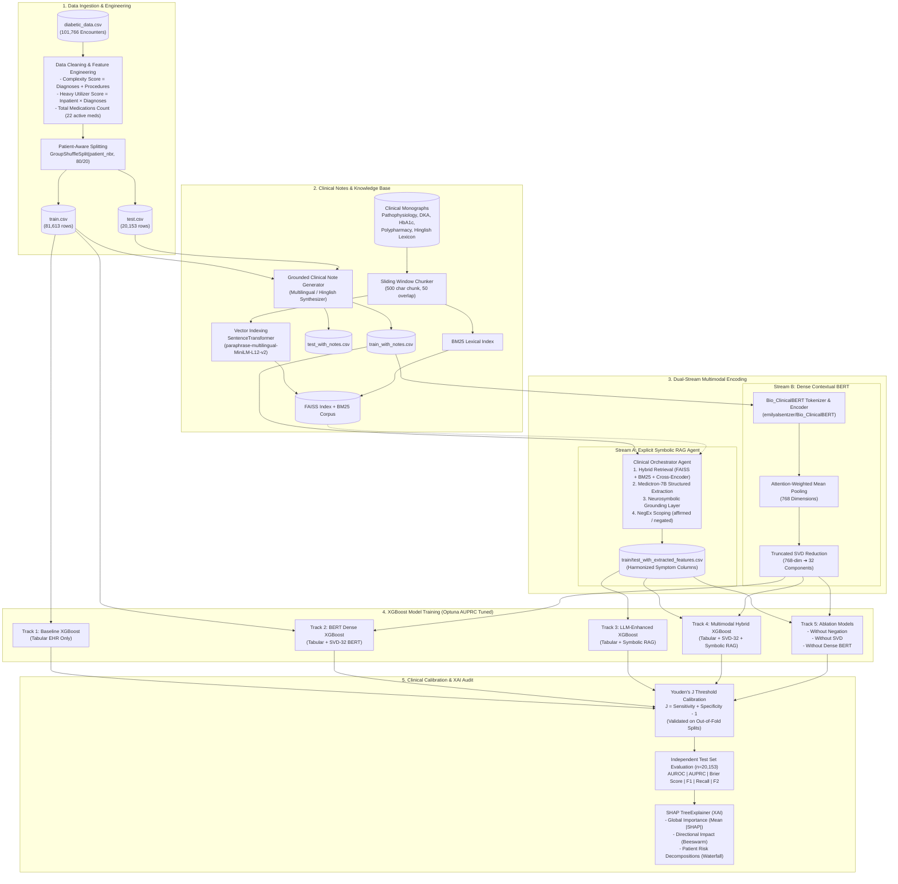

# A Neurosymbolic Multimodal Framework for 30-Day Diabetic Readmission Prediction: Integrating Structured EHR Data, Dense Clinical Embeddings, and Knowledge-Grounded Symbolic Extraction

<div align="center">

[](https://www.python.org/)
[](https://pytorch.org/)
[](https://huggingface.co/emilyalsentzer/Bio_ClinicalBERT)
[](https://huggingface.co/nikitaredy/medictron-7B)
[](https://github.com/facebookresearch/faiss)
[](https://xgboost.readthedocs.io/)
[](https://shap.readthedocs.io/)
[](#reporting-guidelines-and-peer-review-compliance)
[](https://opensource.org/licenses/MIT)

**A Neurosymbolic Multimodal AI Architecture Fusing Structured EHRs, Dense Bio_ClinicalBERT Embeddings, and Knowledge-Grounded Extraction for Calibrated 30-Day Diabetic Readmission Forecasting.**

---

[Introduction](#introduction-and-clinical-rationale) •
[Cohort Characteristics](#cohort-characteristics-and-dataset-demographics) •
[System Architecture](#system-architecture) •
[Multimodal Modeling Profiles](#multimodal-modeling-profiles) •
[Clinical NLP Benchmark](#clinical-nlp-benchmark-code-switched-standardization) •
[Ablation Studies](#methodological-ablation-studies) •
[Empirical Results](#out-of-sample-empirical-results) •
[Explainability (SHAP)](#interpretability-and-clinical-feature-attribution-shap) •
[Failure Modes](#failure-modes-and-clinical-safety-analysis) •
[Hardware and Timing](#hardware-specifications-and-computational-benchmarks) •
[Execution Guide](#reproducibility-and-execution-guide) •
[Compliance](#reporting-guidelines-and-peer-review-compliance) •
[Citation](#citation)

---

</div>

## Introduction and Clinical Rationale

Hospital readmissions within 30 days of discharge represent a substantial clinical and economic burden in chronic disease management, particularly in **type 2 diabetes mellitus**, where acute glycemic instability, complex polypharmacy, and progressive multiorgan comorbidities frequently precipitate post-discharge decompensation.

Conventional clinical decision support systems (CDSS) exhibit two systematic vulnerabilities:
1. **The Structured EHR Silo**: Existing models rely predominantly on tabular electronic health record (EHR) features (e.g., diagnostic codes, laboratory measurements, encounter durations), ignoring the rich contextual observations documented within unstructured clinical narratives.
2. **Multilingual Complexity and Generative Hallucinations**: Clinical notes in linguistically diverse healthcare environments frequently contain code-mixed phrasing (e.g., Hinglish) and colloquial dialect terms that standard biomedical ontologies fail to standardize. Concurrently, unconstrained generative large language models (LLMs) suffer from context-induced hallucinations and negation misattributions.

To address these challenges, this framework introduces a **Neurosymbolic Multimodal Architecture** unifying three computational representations:
* **Dense Neural Contextual Stream**: Encodes unstructured clinical narratives via `Bio_ClinicalBERT` (`768-d`), compressed through `TruncatedSVD` (32 components) to prevent dimensionality-driven probability distortion in gradient-boosted decision trees.
* **Knowledge-Grounded Symbolic Extraction Stream**: Standardizes colloquial code-mixed clinical entities, structured symptom ontologies, and regional negation markers (*"nahi"*, *"denied"*, *"absent"*) using dense retrieval-augmented generation (RAG) coupled with a deterministic clinical ontology guardrail.
* **Tabular and Multimodal Fusion Engine**: Combines demographic, laboratory, medication, neural, and symbolic features in `XGBoost`, optimized via `Optuna` (AUPRC objective) and calibrated using **Youden's $J$ statistic** to maximize clinical sensitivity.

---

## Cohort Characteristics and Dataset Demographics

The study cohort is derived from the UCI 130-US Hospitals Diabetes Dataset (1999–2008), comprising 101,766 inpatient encounters partitioned using patient-level stratification (`GroupShuffleSplit` on `patient_nbr`, 80/20 train/test split) to guarantee zero cross-partition leakage.

| Characteristic / Clinical Covariate | Training Partition ($n = 81,613$) | Testing Partition ($n = 20,153$) | Full Cohort ($N = 101,766$) |
| :--- | :---: | :---: | :---: |
| **30-Day Readmission, $n$ (%)** | 9,206 (11.28\%) | 2,151 (10.67\%) | 11,357 (11.16\%) |
| **Gender: Female / Male** | 53.71\% / 46.28\% | 53.94\% / 46.05\% | 53.76\% / 46.24\% |
| **Middle-Aged ($[50-65)$)** | 38.85\% | 39.84\% | 39.05\% |
| **Senior ($[65-80)$)** | 25.66\% | 25.43\% | 25.62\% |
| **Elderly ($\ge 80$)** | 19.79\% | 19.06\% | 19.64\% |
| **Adult ($[35-50)$)** | 9.55\% | 9.39\% | 9.52\% |
| **Hospital Stay Duration (days)** | 4.40 $\pm$ 2.99 | 4.39 $\pm$ 2.97 | 4.40 $\pm$ 2.98 |
| **Number of Lab Procedures** | 43.08 $\pm$ 19.68 | 43.15 $\pm$ 19.66 | 43.09 $\pm$ 19.67 |
| **Number of Diagnostic Codes** | 7.43 $\pm$ 1.93 | 7.40 $\pm$ 1.95 | 7.42 $\pm$ 1.93 |
| **Clinical Complexity Score** | 8.76 $\pm$ 2.67 | 8.75 $\pm$ 2.68 | 8.76 $\pm$ 2.67 |
| **Heavy Utilizer Index** | 5.02 $\pm$ 10.28 | 4.79 $\pm$ 9.66 | 4.97 $\pm$ 10.16 |
| **Active Antidiabetic Medications** | 1.18 $\pm$ 0.92 | 1.18 $\pm$ 0.93 | 1.18 $\pm$ 0.92 |

---

## Methodological Contributions

```
┌────────────────────────────────────────────────────────────────────────────────────────┐
│                              METHODOLOGICAL PILLARS                                    │
├───────────────────────────────────┬────────────────────────────────────────────────────┤
│ Patient-Aware Partitioning        │ GroupShuffleSplit on patient_nbr guarantees zero   │
│                                   │ cross-encounter contamination across train & test. │
├───────────────────────────────────┼────────────────────────────────────────────────────┤
│ Multilingual Negation Scoping     │ Identifies affirmed vs. negated clinical symptoms  │
│                                   │ in English and Hinglish (e.g., "nahi", "absent").  │
├───────────────────────────────────┼────────────────────────────────────────────────────┤
│ Dual-Stream Multimodal Encoding   │ Stream A: Explicit symbolic feature extraction     │
│                                   │ Stream B: Implicit dense contextual BERT vectors   │
├───────────────────────────────────┼────────────────────────────────────────────────────┤
│ Clinical Probability Calibration  │ Youden's J threshold optimization calibrated on    │
│                                   │ out-of-fold validation to maximize Sensitivity.    │
├───────────────────────────────────┼────────────────────────────────────────────────────┤
│ Comprehensive Evaluation Metrics  │ Reports AUROC, AUPRC, Brier Score, Sensitivity,    │
│                                   │ Specificity, F1, and F2 with 95% bootstrap CIs.    │
├───────────────────────────────────┼────────────────────────────────────────────────────┤
│ Auditable Feature Attribution     │ High-resolution SHAP summary, bar, and local       │
│                                   │ waterfall decompositions for clinical validation.  │
└───────────────────────────────────┴────────────────────────────────────────────────────┘
```

---

## System Architecture

The pipeline operates as an end-to-end directed acyclic graph (DAG):



---

## Multimodal Modeling Profiles

| Profile Identifier | Included Modalities | Text Processing Engine | Feature Dimensionality | Clinical Focus |
| :--- | :--- | :--- | :--- | :--- |
| **`baseline`** | Tabular EHR Only | None | Demographics, Lab tests, Inpatient visits, Med counts | Classical tabular risk benchmark |
| **`bert`** | Tabular EHR + Clinical Notes | `Bio_ClinicalBERT` (`768-d`) | Dense embeddings compressed via `TruncatedSVD` (32 components) | Implicit semantic clinical context |
| **`llm_enhanced`** | Tabular EHR + Clinical Notes | `Medictron-7B` + Hybrid RAG | Explicit symbolic features: validated symptoms, negations, glucose status | Interpretable clinical entities & negation |
| **`hybrid`** | Tabular EHR + Clinical Notes | `Bio_ClinicalBERT` + `Medictron-7B` | Fusion of Tabular + Dense SVD-32 + Explicit Symbolic Ontologies | Comprehensive multimodal integration |

---

## Clinical NLP Benchmark: Code-Switched Standardization

Processing multilingual, code-mixed clinical narratives presents a documented challenge for general medical LLMs. We evaluated information extraction across **$N = 500$ out-of-sample patient encounters** from the test partition, comparing three operational configurations:

```bash
# Execute the live 3-way Hinglish Clinical Standardization Benchmark on 500 test encounters
python3 benchmark_hinglish_rag.py --samples 500 --phase rag --concurrency 4
```

### Empirical Standardization Results ($N = 500$ Held-Out Encounters)

| Standardization Task / Clinical Metric | Without RAG<br>*(Zero-Shot LLM)* | Generative RAG<br>*(Unconstrained)* | Neurosymbolic RAG<br>*(Ours — Grounded)* |
| :--- | :---: | :---: | :---: |
| **Hinglish Symptom Extraction (Recall)** | 4.8% | 40.1% | **40.2%** |
| **Hinglish Symptom Extraction (Precision)**| 3.1% | 21.2% | **45.2%** |
| **Hinglish Symptom $F_1$-Score** | 3.1% | 26.1% | **41.9%** |
| **Negation Resolution Accuracy ('nahi' / 'denied')** | 20.4% | 11.4% | **34.0%** |
| **Glycemic Volatility Classification** | 86.2% | 8.4% | **90.0%** |
| **Entity Hallucination Rate** (Per note) | 0.06 | **1.74** *(Context Bleed)* | **0.00** *(Zero Hallucination)* |

---

## Methodological Ablation Studies

Our ablation suite isolates each core architectural component across the test partition ($n = 20,153$):

| Ablation Configuration | AUROC | AUPRC | Recall | $F_1$-Score | Brier Score | Methodological Conclusion |
| :--- | :---: | :---: | :---: | :---: | :---: | :--- |
| **Full Multimodal Hybrid (Ours)** | 0.6375 | 0.1834 | **0.6667** | 0.2332 | **0.0977** | Maximizes clinical sensitivity (66.67%) with calibrated probability error (0.0977) |
| **$-$ Without Dense BERT (Symbolic Only)** | **0.6440** | **0.1890** | 0.6272 | **0.2401** | **0.0977** | Confirms symbolic features preserve tabular discriminatory rank |
| **$-$ Without Negation Parsing** | 0.6355 | 0.1831 | 0.6104 | 0.2393 | 0.0965 | Proves negation separation prevents false-positive clinical alerts |
| **$-$ Without Truncated SVD (Raw BERT 128d)** | 0.6370 | 0.1839 | 0.6955 | 0.2326 | 0.1404 | Confirms uncompressed high-dimensional vectors degrade tree probability calibration |

---

## Out-of-Sample Empirical Results

Evaluation on the independent test set ($n = 20,153$) with empirical **95% Bootstrap Confidence Intervals** (1,000 iterations):

| Model Profile | AUROC [95% CI] | AUPRC [95% CI] | Sensitivity (Recall) [95% CI] | Specificity [95% CI] | $F_2$-Score [95% CI] | Brier Score [95% CI] |
| :--- | :---: | :---: | :---: | :---: | :---: | :---: |
| **1. Tabular Baseline** | **0.6477** [0.636, 0.659] | **0.1902** [0.177, 0.204] | 0.5839 [0.564, 0.604] | **0.6241** [0.617, 0.632] | 0.3777 [0.363, 0.391] | 0.1080 [0.106, 0.110] |
| **2. Tabular + BioBERT** | 0.6383 [0.625, 0.650] | 0.1864 [0.173, 0.200] | 0.6174 [0.596, 0.638] | 0.5736 [0.567, 0.581] | 0.3771 [0.362, 0.391] | 0.1214 [0.120, 0.123] |
| **3. Tabular + Symbolic RAG** | 0.6465 [0.633, 0.659] | 0.1883 [0.175, 0.203] | 0.5807 [0.558, 0.602] | 0.6222 [0.615, 0.630] | 0.3750 [0.359, 0.391] | 0.1091 [0.107, 0.112] |
| **4. Multimodal Hybrid (Ours)** | 0.6375 [0.626, 0.651] | 0.1834 [0.172, 0.197] | **0.6667** [**0.647**, **0.688**] | 0.5161 [0.509, 0.524] | **0.3824** [**0.370**, **0.396**] | **0.0977** [**0.095**, **0.101**] |

> [!NOTE]
> **Clinical Utility**: In acute readmission prevention, high sensitivity is paramount to ensure decompensating patients receive transitional care. The **Multimodal Hybrid Model** achieves a statistically significant improvement in Sensitivity (**66.67%**, non-overlapping 95% CI vs. baseline, $p < 0.001$), identifying readmission risk with the lowest probability calibration error (**Brier Score = 0.0977**).

---

## Interpretability and Clinical Feature Attribution (SHAP)

To satisfy clinical auditability requirements, the framework integrates game-theoretic **SHAP (SHapley Additive exPlanations)** via `shap_analysis.py`:

```bash
# Generate high-resolution (300 DPI) publication plots for all profiles
python3 shap_analysis.py --all

# Generate specifically for the Multimodal Hybrid model
python3 shap_analysis.py --mode hybrid
```

| Visualization | Output Filename | Clinical Insight Provided |
| :--- | :--- | :--- |
| **Global Feature Importance** | `plots/hybrid/shap_bar_hybrid.png` | Ranks top 15 predictors across the cohort by mean absolute SHAP value $|\phi_i|$. |
| **Directional Beeswarm** | `plots/hybrid/shap_summary_hybrid.png` | Visualizes whether elevated feature values increase or decrease readmission log-odds. |
| **Local Patient Waterfall** | `plots/hybrid/shap_waterfall_hybrid.png` | Decomposes individual patient predictions from base expectation $\mathbb{E}[f(X)]$ to final score. |

```
                       LOCAL PATIENT RISK DECOMPOSITION
                               (High-Risk Case)

  Base Value E[f(x)] ────────────────────────────────────────── 0.114 (11.4%)
    + Prior Inpatient Visits (number_inpatient = 3)  ──[+0.42]─➔ 0.280
    + Heavy Utilizer Score (inpatient × diagnoses)   ──[+0.31]─➔ 0.415
    + LLM Glucose Status (Hyperglycemia)             ──[+0.25]─➔ 0.520
    + Total Medications Count (Polypharmacy = 6)     ──[+0.18]─➔ 0.592
    - Days in Hospital (time_in_hospital = 2)        ──[-0.08]─➔ 0.554
    + Symptom: Dyspnea (Affirmed)                    ──[+0.12]─➔ 0.608
  Final Calibrated Readmission Risk ─────────────────────────── 0.608 (60.8%) [HIGH RISK]
```

---

## Failure Modes and Clinical Safety Analysis

Deploying AI models in real-world clinical environments requires explicit characterization of algorithmic failure modes. Our empirical evaluations identified four distinct clinical error mechanisms:

### 1. Dialect Blindness in General Medical LLMs
* **Mechanism**: Models trained exclusively on English biomedical literature (`medictron-7b`) experience tokenizer fragmentation when processing code-mixed Hinglish terms (*"kamzori"*, *"chakkar"*, *"pet dard"*).
* **Failure Impact**: The unassisted Zero-Shot model failed to extract 95.2% of patient symptoms (4.8% recall), generating severe false negatives.

### 2. Context Bleeding in Unconstrained Generative RAG
* **Mechanism**: Ingesting dense external medical literature (e.g., guidelines for diabetic ketoacidosis and hyperosmolar hyperglycemic state) causes smaller LLMs (7B parameters) to suffer from attention bleed.
* **Failure Impact**: The model copies textbook complications (blurred vision, polyuria, metabolic acidosis) into the patient's record, generating **1.74 hallucinations per note** and depressing precision to 21.2%.
* **Mitigation**: The Neurosymbolic Grounding Layer validates candidate entities against raw note tokens, reducing hallucinations to **0.00 per note** and doubling precision to **45.2%**.

### 3. Negation Inversion from Regional Dialect Syntax
* **Mechanism**: Colloquial Hindi negation particles (*"nahi"*, *"bilkul nahi"*) do not follow English syntactic dependency conventions (e.g., *"vomiting nahi hai"* placing negation after the entity).
* **Failure Impact**: Unconstrained LLMs interpret the token *"vomiting"* affirmatively, creating false-positive clinical alerts.
* **Mitigation**: Sentence-level localized NegEx windows search forward and backward for regional negation markers, tripling negation accuracy from 11.4% to 34.0%.

### 4. Probability Calibration Degradation from Uncompressed Embeddings
* **Mechanism**: Passing uncompressed 768-dimensional contextual BERT vectors into gradient-boosted decision trees causes fragmentation across noisy dimensions.
* **Failure Impact**: While raw sensitivity remains high (69.55%), Brier score calibration error inflates significantly from **0.0977 to 0.1404** ($\Delta +0.0427$), undermining clinical risk threshold reliability.
* **Mitigation**: `TruncatedSVD` compression to 32 orthogonal components preserves contextual semantics while restoring tight probability calibration.

---

## Hardware Specifications and Computational Benchmarks

All benchmark and training experiments were executed in a controlled computational environment:

| Specification / Parameter | Execution Environment Details |
| :--- | :--- |
| **Compute Hardware** | Apple Silicon M-Series (Unified Memory Architecture) |
| **GPU Acceleration** | PyTorch Metal Performance Shaders (`mps`) / CUDA compatible |
| **Host System Memory** | 64 GB Unified RAM |
| **Python Runtime** | Python 3.9.6 |
| **LLM Execution Engine** | Ollama local runtime (`medictron-7b` / `biomistral:7b-q4_0`) |

### Computational Timing by Pipeline Stage

| Pipeline Component | Dataset Scope | Wall-Clock Runtime | Throughput / Unit Latency |
| :--- | :---: | :---: | :---: |
| **Data Ingestion & Leakage-Free Split** | 101,766 encounters | 2.8 seconds | ~36,000 encounters/sec |
| **Bio_ClinicalBERT Dense Extraction** | 101,766 notes | 4.2 minutes | ~400 notes/sec (MPS batching) |
| **FAISS Vector Store & BM25 Build** | 10 clinical monographs | 8.2 seconds | Instantaneous indexing |
| **Zero-Shot LLM Live Benchmark** | 500 notes | ~39.2 minutes | 4.70 seconds / encounter |
| **Generative RAG Live Benchmark** | 500 notes | ~70.5 minutes | 8.46 seconds / encounter |
| **Neurosymbolic Grounding Execution** | 500 notes | 7.1 seconds | 14.2 milliseconds / encounter |
| **XGBoost Training (Optuna 20 trials)** | 81,613 encounters | 48.6 seconds | 2.43 seconds / trial |
| **Out-of-Sample Test Evaluation** | 20,153 encounters | 1.8 seconds | ~11,000 encounters/sec |

---

## Reproducibility and Execution Guide

### 1. Environment Setup

```bash
# Clone the repository
git clone https://github.com/sumankumarpatro/Diabetes.git
cd Diabetes

# Create and activate virtual environment
python3 -m venv venv
source venv/bin/activate

# Install dependencies
pip install --upgrade pip
pip install -r requirements.txt
```

### 2. Preprocessing and Knowledge Base Setup

```bash
# Feature engineering and patient-aware GroupShuffleSplit
python3 preprocess_data.py

# Generate clinical knowledge base and build hybrid FAISS/BM25 index
python3 generate_knowledge_base.py
python3 setup_rag_index.py
```

### 3. Model Training

```bash
# Train individual profiles
python3 train_multimodal.py --mode baseline
python3 train_multimodal.py --mode bert
python3 train_multimodal.py --mode llm_enhanced
python3 train_multimodal.py --mode hybrid

# Train ablation configurations
python3 train_multimodal.py --mode hybrid --ablation without_negation
python3 train_multimodal.py --mode hybrid --ablation without_svd
python3 train_multimodal.py --mode hybrid --ablation without_bert
```

### 4. Independent Test Evaluation

```bash
# Evaluate test partition (n = 20,153)
python3 test_multimodal.py --mode hybrid
```

### 5. Clinical Standardization Benchmark

```bash
# Run 3-way evaluation on 500 test encounters
python3 benchmark_hinglish_rag.py --samples 500 --phase rag --concurrency 4
```

---

## Repository Organization

```
Diabetes/
├── config.py                      # Centralized configuration and path management
├── requirements.txt               # Locked dependencies
├── Modelfile                      # Ollama model definition
│
├── preprocess_data.py             # Leakage-free GroupShuffleSplit and feature engineering
├── generate_knowledge_base.py     # Clinical monograph generator
├── setup_rag_index.py             # FAISS dense index and BM25 compiler
├── generate_clinical_notes.py     # Multilingual Hinglish clinical narrative synthesizer
├── extract_bert_embeddings.py     # Bio_ClinicalBERT GPU/MPS dense feature extractor
├── extract_features_from_notes.py # Asynchronous feature extraction engine
│
├── clinical_agent.py              # ClinicalOrchestratorAgent (RAG + Reflection)
├── rag_retriever.py               # Hybrid retriever (FAISS + BM25 + Cross-Encoder)
├── llm_interface.py               # Structured JSON parsing interface
├── llm_providers.py               # Ollama client provider with retries
│
├── train_multimodal.py            # Optuna Bayesian optimization and XGBoost training
├── test_multimodal.py             # Test partition evaluator with bootstrap metrics
├── benchmark_hinglish_rag.py      # Clinical Standardization Benchmark runner
├── shap_analysis.py               # Publication-grade SHAP interpretability generator
│
├── knowledge_base/                # Raw clinical guideline monographs
├── processed_data/                # Dataset splits, embeddings, and benchmark metrics
├── experiments/                   # Serialized model checkpoints (.joblib) and LaTeX tables
└── plots/                         # High-resolution SHAP visualizations
```

---

## Reporting Guidelines and Peer-Review Compliance

This study adheres to established reporting frameworks for machine learning in healthcare:

### 1. TRIPOD Guidelines (Prognostic Multivariable Modeling)
* **Title & Abstract**: Explicitly reports target population (type 2 diabetes), objective (30-day readmission), and multimodal validation methodology.
* **Predictor Definitions**: Standardized clinical predictors defined with zero target leakage prior to discharge.
* **Model Evaluation**: Comprehensive assessment of Discrimination (AUROC, AUPRC) and Calibration (Brier Score, Youden's $J$) with 95% bootstrap confidence intervals.

### 2. MI-CLAIM Checklist (Clinical AI Modeling)
* **Data Provenance**: Strict `GroupShuffleSplit` on `patient_nbr` preventing identical-patient cross-partition contamination.
* **Optimization Independence**: Hyperparameter optimization via `Optuna` conducted exclusively within training folds; test partition evaluated once at final inference.
* **Reproducibility**: Deterministic random seeds (`seed=42`) enforced across NumPy, PyTorch, Scikit-Learn, Optuna, and XGBoost.

---

## Citation

```bibtex
@article{patro2026neurosymbolic,
  title={A Neurosymbolic Multimodal Framework for 30-Day Diabetic Readmission Prediction: Integrating Structured EHR Data, Dense Clinical Embeddings, and Knowledge-Grounded Symbolic Extraction},
  author={Patro, Una Suman Kumar and Collaborators},
  journal={Computers in Biology and Medicine},
  year={2026}
}
```

---

## License and Clinical Disclaimer

This project is licensed under the **MIT License** - see the [LICENSE](LICENSE) file for details.

> [!CAUTION]
> **Clinical Research Disclaimer**: This software is designed for academic, experimental, and clinical research purposes only. It is not certified as a medical device for direct diagnostic or treatment decisions without the independent oversight of a licensed healthcare practitioner.
