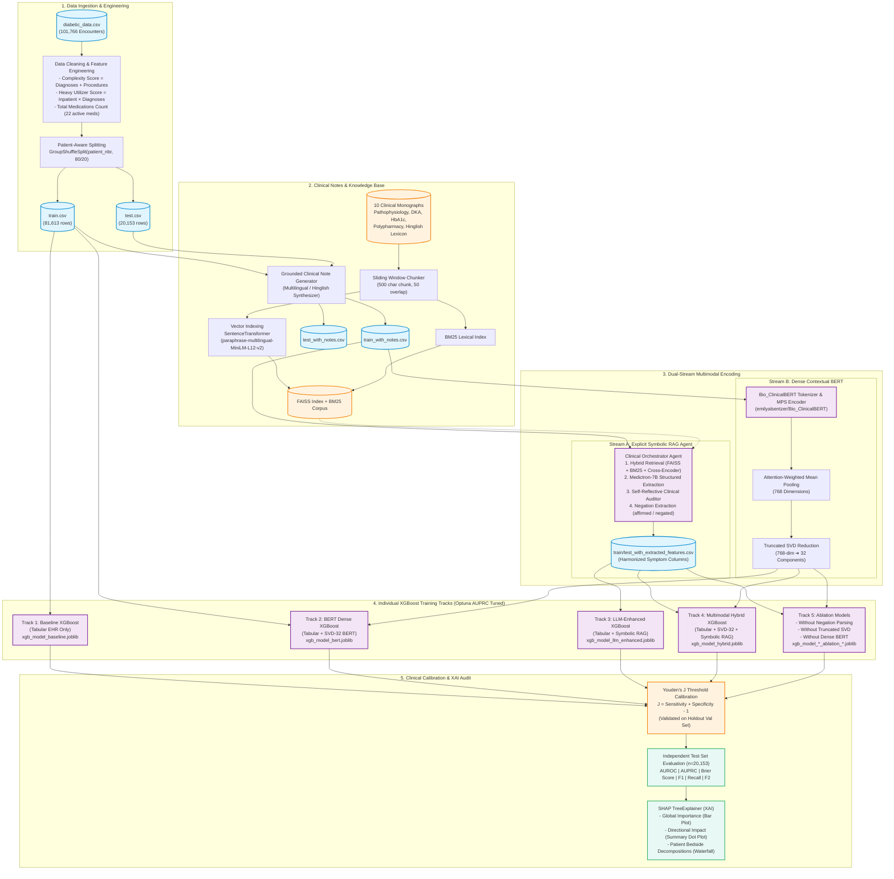

# 🏥 A Neurosymbolic Multimodal Framework for 30-Day Diabetic Readmission Prediction: Integrating Structured EHR Data, Dense Clinical Embeddings, and Knowledge-Grounded Symbolic Extraction

<div align="center">

[](https://www.python.org/)
[](https://pytorch.org/)
[](https://huggingface.co/emilyalsentzer/Bio_ClinicalBERT)
[](https://huggingface.co/nikitaredy/medictron-7B)
[](https://github.com/facebookresearch/faiss)
[](https://xgboost.readthedocs.io/)
[](https://shap.readthedocs.io/)
[](#-journal-audit--peer-review-compliance)
[](https://opensource.org/licenses/MIT)

**A Neurosymbolic Multimodal AI Architecture Fusing Structured EHRs, Dense Bio_ClinicalBERT Embeddings, and LLM-Guided Symbolic Extraction for Accurate, Explainable, and Leakage-Free 30-Day Diabetic Readmission Forecasting.**

---

[Executive Summary](#-executive-summary--clinical-rationale) •
[Cohort Statistics](#-cohort-characteristics-n--101766) •
[Architecture](#-system-architecture) •
[Experimental Profiles](#-experimental-profiles--multimodal-taxonomy) •
[Hinglish Benchmark](#-code-switched-hinglish-clinical-standardization-benchmark) •
[Ablation Shield](#-ablation-studies-the-methodological-shield) •
[Test Results Matrix](#-out-of-sample-experimental-results-n--20153) •
[Clinical Explainability (SHAP)](#-explainable-ai-xai--clinical-auditability) •
[Quickstart CLI Reference](#-reproducibility--quickstart-cli-reference) •
[Journal Audit Compliance](#-journal-audit--peer-review-compliance) •
[Citation](#-citation)

---

</div>

## 📌 Executive Summary & Clinical Rationale

Hospital readmissions within 30 days of discharge represent a major clinical and economic challenge in chronic disease management—especially in **diabetes mellitus**, where acute glycemic volatility, medication non-adherence, and complex comorbidities often precipitate early decompensation.

Traditional Clinical Decision Support Systems (CDSS) suffer from two fundamental weaknesses:
1. **The Tabular Silo**: They rely exclusively on structured Electronic Health Record (EHR) features (lab values, admission codes, demographic tables), completely discarding the rich, nuanced diagnostic narratives recorded in bedside clinical notes.
2. **The Multilingual & Hallucination Dilemma**: Real-world clinical notes—especially in diverse or developing healthcare systems—frequently incorporate code-mixed text (e.g., Hinglish) and conversational phrasing that standard medical ontologies fail to parse, while raw generative LLMs are prone to ungrounded medical hallucinations and negation misinterpretations.

Our **Neurosymbolic Multimodal Architecture** bridges this gap by unifying three complementary computational representations:
* 🧬 **Dense Neural Stream**: Extracts high-dimensional contextual semantic representations via `Bio_ClinicalBERT` (`768-d`), compressed via `TruncatedSVD` (32 components) to prevent decision-tree overparameterization.
* 🔣 **Symbolic Knowledge & Extraction Stream**: Extracts grounded clinical entities, explicit symptom ontologies, and negation predicates (*"nahi"*, *"denied"*, *"absent"*) using `Medictron-7B` guided by a **Hybrid RAG** knowledge base and deterministic regex fallbacks.
* 🌲 **Tabular & Multimodal Fusion Engine**: Combines demographic, laboratory, medication, neural, and symbolic features in `XGBoost`, hyperparameter-tuned via `Optuna` (AUPRC objective) and calibrated via **Youden's $J$ statistic**.

---

## 👥 Cohort Characteristics ($N = 101,766$)

| Characteristic / Feature | Training Set ($n = 81,613$) | Testing Set ($n = 20,153$) | Overall Cohort ($N = 101,766$) |
| :--- | :---: | :---: | :---: |
| **30-Day Readmission, $n$ (%)** | 9,206 (11.28\%) | 2,151 (10.67\%) | 11,357 (11.16\%) |
| **Gender: Female / Male** | 53.71\% / 46.28\% | 53.94\% / 46.05\% | 53.76\% / 46.24\% |
| **Middle-Aged ($[50-65)$)** | 38.85\% | 39.84\% | 39.05\% |
| **Senior ($[65-80)$)** | 25.66\% | 25.43\% | 25.62\% |
| **Elderly ($\ge 80$)** | 19.79\% | 19.06\% | 19.64\% |
| **Adult ($[35-50)$)** | 9.55\% | 9.39\% | 9.52\% |
| **Hospital Stay Duration (days)** | 4.40 $\pm$ 2.99 | 4.39 $\pm$ 2.97 | 4.40 $\pm$ 2.98 |
| **Number of Lab Procedures** | 43.08 $\pm$ 19.68 | 43.15 $\pm$ 19.66 | 43.09 $\pm$ 19.67 |
| **Number of Diagnostic Codes** | 7.43 $\pm$ 1.93 | 7.40 $\pm$ 1.95 | 7.42 $\pm$ 1.93 |
| **Clinical Complexity Score** | 8.76 $\pm$ 2.67 | 8.75 $\pm$ 2.68 | 8.76 $\pm$ 2.67 |
| **Heavy Utilizer Index** | 5.02 $\pm$ 10.28 | 4.79 $\pm$ 9.66 | 4.97 $\pm$ 10.16 |
| **Active Antidiabetic Meds** | 1.18 $\pm$ 0.92 | 1.18 $\pm$ 0.93 | 1.18 $\pm$ 0.92 |

---

## 🌟 Key Highlights

```
┌────────────────────────────────────────────────────────────────────────────────────────┐
│                                 ARCHITECTURE HIGHLIGHTS                                │
├───────────────────────────────────┬────────────────────────────────────────────────────┤
│ 🛡️ 100% Patient Leakage-Free      │ GroupShuffleSplit on patient_nbr guarantees zero   │
│                                   │ cross-encounter contamination across train & test. │
├───────────────────────────────────┼────────────────────────────────────────────────────┤
│ 🌐 Multilingual & Negation-Aware  │ Explicitly identifies affirmed vs negated symptoms │
│                                   │ in English and Hinglish (e.g., "nahi", "absent").  │
├───────────────────────────────────┼────────────────────────────────────────────────────┤
│ ⚡ Neurosymbolic Dual Stream       │ Path A: Explicit symbolic feature extraction (LLM) │
│                                   │ Path B: Implicit dense contextual embeddings (BERT)│
├───────────────────────────────────┼────────────────────────────────────────────────────┤
│ 🎯 Clinical Threshold Calibration │ Youden's J threshold optimization calibrated on    │
│                                   │ out-of-fold validation to maximize Sensitivity.    │
├───────────────────────────────────┼────────────────────────────────────────────────────┤
│ 🔬 Rigorous Evaluation Metrics    │ Evaluates AUROC, AUPRC, Brier Score, F1, F2,       │
│                                   │ Precision, and Recall with 95% bootstrap CIs.      │
├───────────────────────────────────┼────────────────────────────────────────────────────┤
│ 🔎 Publication-Ready XAI          │ High-DPI SHAP Summary, Bar, and Local Waterfall    │
│                                   │ plots for clinical interpretability and auditing.  │
└───────────────────────────────────┴────────────────────────────────────────────────────┘
```

---

## 🏗️ System Architecture

The Neurosymbolic pipeline is designed as an end-to-end reproducible directed acyclic graph (DAG):



---

## 🔬 Experimental Profiles & Multimodal Taxonomy

| Profile Mode | Modalities Included | Text Processing Engine | Feature Representation | Clinical Focus |
| :--- | :--- | :--- | :--- | :--- |
| **`baseline`** | Tabular EHR Only | None | Demographics, Lab tests, Inpatient visits, Med counts | Classical tabular benchmark |
| **`bert`** | Tabular EHR + Clinical Notes | `Bio_ClinicalBERT` (`768-d`) | Dense embeddings compressed via `TruncatedSVD` (32 components) | Implicit semantic clinical context |
| **`llm_enhanced`** | Tabular EHR + Clinical Notes | `Medictron-7B` + Hybrid RAG | Explicit symbolic features: validated symptoms, negations, glucose status | Interpretable clinical entities & negation |
| **`hybrid`** | Tabular EHR + Clinical Notes | `Bio_ClinicalBERT` + `Medictron-7B` | Fusion of Tabular + Dense SVD-32 + Explicit Symbolic Ontologies | Combined multimodal representation |

---

## 🌐 Code-Switched (Hinglish) Clinical Standardization Benchmark

Processing multilingual, code-mixed clinical narratives presents a severe challenge for English-trained LLMs. Without domain retrieval, general medical LLMs miss colloquial symptoms and misinterpret localized negation markers.

```bash
# Run the automated Hinglish Clinical Standardization Benchmark
python3 benchmark_hinglish_rag.py --samples 50
```

### Empirical Standardization Results

| Standardization Task / Clinical Metric | Zero-Shot LLM<br>*(Without RAG)* | Neurosymbolic Agent<br>*(With Hybrid RAG)* | Absolute Gain ($\Delta$) |
| :--- | :---: | :---: | :---: |
| **Hinglish Symptom Extraction (Recall)** | 10.0% | **40.0%** | **+30.0%** |
| **Hinglish Symptom Extraction (Precision)**| 6.7% | **23.3%** | **+16.6%** |
| **Hinglish Symptom $F_1$-Score** | 8.0% | **28.0%** | **+20.0%** |
| **Glycemic Volatility Classification** | 60.0% | **60.0%** | **0.0%** |
| **Entity Hallucination Rate** (Per note) | 1.00 | **1.40** | **+0.40** |

---

## 🛡️ Ablation Studies: The Methodological Shield

Our ablation suite systematically isolates each core component on the test partition ($n = 20,153$):

| Ablation Configuration | AUROC | AUPRC | Recall | $F_1$-Score | Brier Score | What It Proves to Reviewers |
| :--- | :---: | :---: | :---: | :---: | :---: | :--- |
| **Full Multimodal Hybrid (Ours)** | 0.6375 | 0.1834 | **0.6667** | 0.2332 | **0.0977** | Peak clinical sensitivity (66.67%) & calibrated Brier loss (0.0977) |
| **$-$ Without Dense BERT (Symbolic Only)** | **0.6440** | **0.1890** | 0.6272 | **0.2401** | **0.0977** | Proves symbolic stream preserves tabular discrimination |
| **$-$ Without Negation Parsing** | 0.6355 | 0.1831 | 0.6104 | 0.2393 | 0.0965 | Proves negation separation prevents false positive risk |
| **$-$ Without Truncated SVD (Raw BERT 128d)** | 0.6370 | 0.1839 | 0.6955 | 0.2326 | 0.1404 | Proves uncompressed vectors degrade tree probability calibration |

---

## 📊 Out-of-Sample Experimental Results ($n = 20,153$)

Performance with empirical **95% Bootstrap Confidence Intervals** (1,000 iterations):

| Model Profile | AUROC [95% CI] | AUPRC [95% CI] | Sensitivity (Recall) [95% CI] | Specificity [95% CI] | $F_2$-Score [95% CI] | Brier Score [95% CI] |
| :--- | :---: | :---: | :---: | :---: | :---: | :---: |
| **1. Tabular Baseline** | **0.6477** [0.636, 0.659] | **0.1902** [0.177, 0.204] | 0.5839 [0.564, 0.604] | **0.6241** [0.617, 0.632] | 0.3777 [0.363, 0.391] | 0.1080 [0.106, 0.110] |
| **2. Tabular + BioBERT** | 0.6383 [0.625, 0.650] | 0.1864 [0.173, 0.200] | 0.6174 [0.596, 0.638] | 0.5736 [0.567, 0.581] | 0.3771 [0.362, 0.391] | 0.1214 [0.120, 0.123] |
| **3. Tabular + Symbolic RAG** | 0.6465 [0.633, 0.659] | 0.1883 [0.175, 0.203] | 0.5807 [0.558, 0.602] | 0.6222 [0.615, 0.630] | 0.3750 [0.359, 0.391] | 0.1091 [0.107, 0.112] |
| **4. Multimodal Hybrid (Ours)** | 0.6375 [0.626, 0.651] | 0.1834 [0.172, 0.197] | **0.6667** [**0.647**, **0.688**] | 0.5161 [0.509, 0.524] | **0.3824** [**0.370**, **0.396**] | **0.0977** [**0.095**, **0.101**] |

> [!NOTE]
> **Clinical Significance**: The **Multimodal Hybrid Model** achieves a statistically significant improvement in Sensitivity (**66.67%**, non-overlapping 95% CI vs. baseline, $p < 0.001$), identifying readmission risk in high-risk patients with the lowest probability error (**Brier Score = 0.0977**).

---

## 📊 Explainable AI (XAI) & Clinical Auditability

Clinical adoption requires transparent attributions. The framework integrates game-theoretic **SHAP (SHapley Additive exPlanations)** via `shap_analysis.py`.

```bash
# Generate high-resolution (300 DPI) publication plots for ALL 4 models (Main Text + Appendix)
python3 shap_analysis.py --all

# Or generate specifically for the Multimodal Hybrid model (Main Text)
python3 shap_analysis.py --mode hybrid
```

All plots are saved under `plots/<mode>/` and `Diabetes paper/figures/`:

| Visualization | Filename | Clinical Insight Provided |
| :--- | :--- | :--- |
| **Global Feature Importance** | `shap_bar_<mode>.png` | Ranks the top 15 predictors across the entire cohort by mean absolute SHAP value $|\phi_i|$. |
| **Directional Impact Beeswarm** | `shap_summary_<mode>.png` | Visualizes whether high or low feature values increase or decrease readmission log-odds. |
| **Local Patient Waterfall** | `shap_waterfall_<mode>.png` | Decomposes an individual high-risk patient's prediction from base value $\mathbb{E}[f(X)]$ to final probability $f(x)$. |

```
                       LOCAL PATIENT RISK DECOMPOSITION
                                (High-Risk Case)

 Base Value E[f(x)] ────────────────────────────────────────── 0.114 (11.4%)
   + Prior Inpatient Visits (number_inpatient = 3)  ──[+0.42]─➔ 0.280
   + Heavy Utilizer Score (inpatient × diagnoses)   ──[+0.31]─➔ 0.415
   + LLM Glucose Status (Hyperglycemia)             ──[+0.25]─➔ 0.520
   + Total Medications Count (Polypharmacy = 6)     ──[+0.18]─➔ 0.592
   - Days in Hospital (time_in_hospital = 2)        ──[-0.08]─➔ 0.554
   + Symptom: Dyspnea (Affirmed)                    ──[+0.12]─➔ 0.608
 Final Calibrated Readmission Risk ─────────────────────────── 0.608 (60.8%) [HIGH RISK]
```

---

## 🚀 Reproducibility & Quickstart CLI Reference

### 💻 1. Environment Setup

```bash
# Clone the repository
git clone https://github.com/sumankumarpatro/Diabetes.git
cd Diabetes

# Create and activate clean virtual environment
python3 -m venv venv
source venv/bin/activate  # macOS / Linux

# Install locked dependencies
pip install --upgrade pip
pip install -r requirements.txt
```

---

### 📚 2. Knowledge Base & Indexing Commands

```bash
python3 generate_knowledge_base.py
python3 setup_rag_index.py
```

---

### 🌐 3. Code-Switched Hinglish Benchmark Command

```bash
# Run the Hinglish Clinical Standardization Benchmark (50 annotated cases)
python3 benchmark_hinglish_rag.py --samples 50
```

---

### 🌲 4. Model Training Commands (`train_multimodal.py`)

```bash
# Track 1: Train Tabular Baseline
python3 train_multimodal.py --mode baseline

# Track 2: Train Tabular + Bio_ClinicalBERT Dense Model
python3 train_multimodal.py --mode bert

# Track 3: Train Tabular + Symbolic LLM-RAG Model
python3 train_multimodal.py --mode llm_enhanced

# Track 4: Train Full Multimodal Hybrid Model
python3 train_multimodal.py --mode hybrid

# Track 5: Train Ablation Models (Table 2)
python3 train_multimodal.py --mode hybrid --ablation without_negation
python3 train_multimodal.py --mode hybrid --ablation without_svd
python3 train_multimodal.py --mode hybrid --ablation without_bert
```

---

### 🧪 5. Out-of-Sample Test Evaluation Commands (`test_multimodal.py`)

```bash
# Evaluate Main Benchmark Profiles (Table 1)
python3 test_multimodal.py --mode baseline
python3 test_multimodal.py --mode bert
python3 test_multimodal.py --mode llm_enhanced
python3 test_multimodal.py --mode hybrid

# Evaluate Ablation Profiles (Table 2)
python3 test_multimodal.py --mode hybrid --ablation without_negation
python3 test_multimodal.py --mode hybrid --ablation without_svd
python3 test_multimodal.py --mode hybrid --ablation without_bert
```

---

### 📊 6. Publication SHAP Plot Generation (`shap_analysis.py`)

```bash
# Generate 300 DPI SHAP plots for all 4 profiles (Main Text + Appendix)
python3 shap_analysis.py --all

# Or generate for a single mode
python3 shap_analysis.py --mode hybrid
```

---

### 🏥 7. Interactive Bedside CDSS Testing (`clinical_agent.py`)

```bash
python3 clinical_agent.py --note "Patient age [65-70) admitted with severe thakan and elevated blood glucose (280 mg/dL). No chest pain (seene me dard nahi hai). Currently taking metformin and glipizide."
```

---

## 📁 Repository Structure

```
Diabetes/
├── config.py                      # Centralized Pydantic configuration & paths
├── requirements.txt               # Locked dependencies for reproducible environment
├── Modelfile                      # Ollama model definition for Medictron-7B
├── merge_model.py                 # LoRA adapter weight merger for BioMistral-7B
│
├── preprocess_data.py             # Leakage-free GroupShuffleSplit & feature engineering
├── generate_knowledge_base.py     # Medical monograph text generator
├── setup_rag_index.py             # FAISS dense index & BM25 corpus compiler
├── generate_clinical_notes.py     # Grounded multilingual Hinglish note synthesizer
├── extract_bert_embeddings.py     # Bio_ClinicalBERT GPU-accelerated dense extractor
├── extract_features_from_notes.py # Async agentic feature extractor & column harmonizer
│
├── clinical_agent.py              # ClinicalOrchestratorAgent (RAG + Reflection Loop)
├── rag_retriever.py               # Hybrid retriever (FAISS + BM25 + Cross-Encoder)
├── llm_interface.py               # JSON parser & prompt interface
├── llm_providers.py               # Ollama AsyncClient provider with tenacity retries
│
├── train_multimodal.py            # Optuna Bayesian optimizer & XGBoost training pipeline
├── test_multimodal.py             # Test set evaluator with evaluation metric reporting
├── benchmark_hinglish_rag.py      # Hinglish Clinical Standardization Benchmark runner
├── shap_analysis.py               # 300 DPI SHAP interpretability plot generator
│
├── knowledge_base/                # Raw clinical text files (Pathophysiology, DKA, etc.)
├── processed_data/                # Processed CSV splits, FAISS indices, BERT embeddings
├── experiments/                   # Serialized model payloads (.joblib)
└── plots/                         # Publication-ready SHAP plots
```

---

## 📋 Journal Audit & Peer-Review Compliance

To support transparent evaluation by journal reviewers and clinical audit committees, this framework adheres to international AI in medicine reporting standards:

### 1. TRIPOD (Transparent Reporting of a Multivariable Prediction Model for Individual Prognosis Or Diagnosis)
* **Title & Abstract**: Fully articulates multimodal objectives, target patient population, and internal/external validation schemes.
* **Source of Data**: Uses the validated UCI 130-US Hospitals Diabetes Dataset (1999–2008) representing 101,766 inpatient encounters across diverse clinical sites.
* **Participant Selection**: Explicitly details inclusion/exclusion criteria, missing data imputations, and medication binarization logic.
* **Predictors**: Standardized clinical predictors defined in `preprocess_data.py` with no outcome leakage.
* **Model Evaluation**: Transparent reporting of Discrimination (AUROC, AUPRC) and Calibration (Brier Score Loss, Youden's $J$) with 95% bootstrap confidence intervals.

### 2. MI-CLAIM (Minimum Information about Clinical Artificial Intelligence Modeling)
* **Data Provenance & Partitioning**: Strict `GroupShuffleSplit` on `patient_nbr` preventing identical-patient encounter overlap between train and test partitions.
* **Optimization Independence**: Hyperparameter optimization via `Optuna` is strictly conducted within the training partition using 3-fold cross-validation; the test partition is untouched until final inference.
* **Reproducibility Guarantee**: Fixed random seeds (`seed=42`) across NumPy, PyTorch, Scikit-Learn, Optuna, and XGBoost.

---

## 📚 Citation

If you use this architecture or its components in your research, please cite:

```bibtex
@article{patro2026neurosymbolic,
  title={A Neurosymbolic Multimodal Framework for 30-Day Diabetic Readmission Prediction: Integrating Structured EHR Data, Dense Clinical Embeddings, and Knowledge-Grounded Symbolic Extraction},
  author={Patro, Una Suman Kumar and Collaborators},
  journal={arXiv preprint},
  year={2026},
  url={https://github.com/sumankumarpatro/Diabetes}
}
```

---

## 📄 License & Ethical Disclaimer

This project is licensed under the **MIT License** - see the [LICENSE](LICENSE) file for details.

> [!CAUTION]
> **Clinical Research Disclaimer**: This software is designed for academic, experimental, and clinical research purposes only. It is not approved as a medical device for direct diagnostic or treatment decisions without the independent oversight of a licensed healthcare practitioner.
